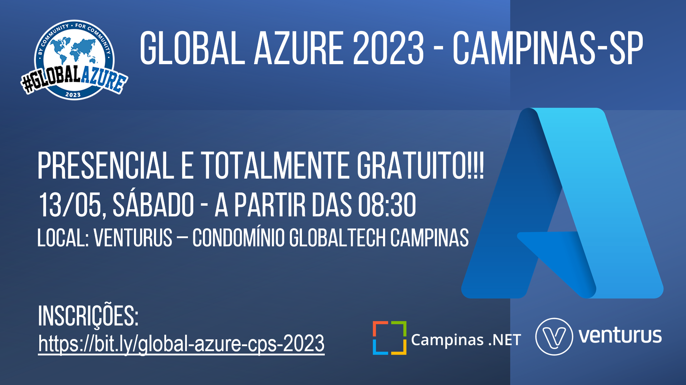
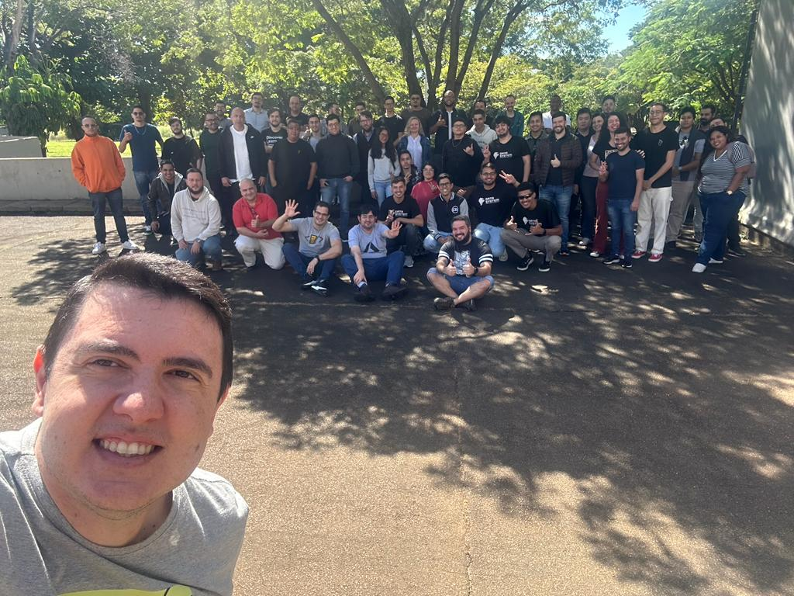

# Global Azure 2023 - Campinas-SP | Presencial e Gratuito
Fotos e informações gerais sobre a edição do **Global Azure** realizada em **13/05/2023** na cidade de **Campinas-SP**.

Organizadores:
- **Renato Groffe (Microsoft MVP, MTAC)**
- **Ericson da Fonseca (Microsoft MVP)**

Número de participantes: **60 pessoas**

Apresentações que aconteceram durante o evento:
* Keynote - Global Azure novamente em Campinas-SP - Ericson da Fonseca (Microsoft MVP)

* Novidades no Desenvolvimento Serverless com .NET 7 e Azure Functions - Renato Groffe (Microsoft MVP, MTAC)

* Painel Interativo sobre Certificações Microsoft: dicas, descontos, exames gratuitos... - Ericson da Fonseca (Microsoft MVP), Renato Groffe (Microsoft MVP, MTAC) e convidados

* Azure & Plataformas Digitais: Estratégia de APIs - Murilo Beltrame (Arquiteto de Soluções, DEVPIRA)

* O que é FinOps? Como economizar na nuvem sem precisar de um curso de Meteorologia! - Felipe Loureiro (Venturus)

* Simplificando a o consumo de serviços do Azure em suas aplicações com os Service Connectors - Robson Rocha de Araújo (Microsoft MVP)

Este evento foi uma parceria entre as comunidades [**Campinas .NET**](https://www.meetup.com/campinasdotnet/), [**.NET SP**](https://www.meetup.com/dotnet-Sao-Paulo/) e [**Azure Talks**](https://www.meetup.com/azure-talks/).

Formulário utilizado para inscrições: [**Sympla**](https://www.sympla.com.br/evento/net-conf-2023-campinas-sp-presencial-e-gratuito/1780810)

Local: Auditório da Venturus - Estrada Giuseppina Vianelli di Napolli, 1185 - Polo II de Alta Tecnologia - Campinas - SP - CEP: 13086-530

---

